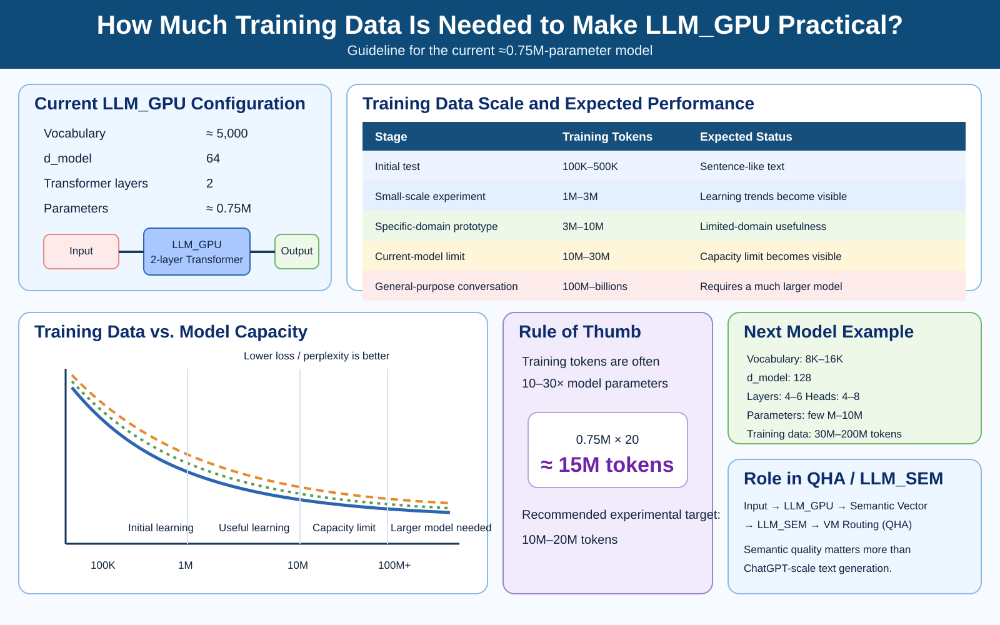

# LLM_GPU

CUDA/PyTorch GPU version of the homemade LLM project.

This repository is based on the architecture and end-to-end flow proven in
`digiponta/LLM` branch `v0.3`. The original educational virtual-GPU runtime
and hand-written backward propagation are replaced by real PyTorch tensors,
CUDA kernels, and PyTorch autograd.

## Architecture

```text
Japanese corpus
    |
character tokenizer
    |
Embedding
    |
Transformer blocks
    |-- LayerNorm
    |-- single-head causal Self-Attention
    |-- residual connection
    |-- LayerNorm
    |-- FFN (Linear -> GELU -> Linear)
    |-- residual connection
    |
final LayerNorm
    |
lm_head
    |
Cross Entropy
    |
PyTorch autograd
    |
AdamW
    |
CUDA GPU
```

## Files

```text
tokenizer.py          character tokenizer compatible with the original project
dataset.py            next-token dataset / uniform sampled windows
model.py              CUDA-capable Transformer language model
train.py              GPU training loop with progress and ETA
train_corpus.py       corpus training entry point
infer.py              interactive GPU inference
check_gpu.py          CUDA/PyTorch diagnostic
prepare_wikipedia.py  Wikipedia dump -> plain text helper
requirements.txt      Python dependencies
```

## Installation

Install a CUDA-enabled PyTorch build suitable for the NVIDIA driver on the PC,
then install the project requirements.

```powershell
python -m pip install -r requirements.txt
python check_gpu.py
```

A successful setup reports:

```text
CUDA available : True
Device         : cuda
GPU            : NVIDIA ...
VRAM           : ... GiB
```

## Training data

By default the trainer looks for:

```text
data/general-ja.txt
data/data-nagato.txt
```

For convenience, if those files do not exist in this repository, it also
looks for the existing original-project files:

```text
../LLM/data/general-ja.txt
../LLM/data/data-nagato.txt
```

## Train

```powershell
python train_corpus.py
```

Default v0.4 long GPU run:

```text
context length : 64
d_model        : 64
layers         : 2
FFN dimension  : 256
attention heads: 1
batch size     : 64
samples        : 120,000,000
epochs         : 3
learning rate  : 5e-4
```

This sample count is estimated from the measured v0.3 benchmark on an
RTX 3070 Ti: 20,000 samples x 3 epochs took about 6 seconds. Linear scaling
gives approximately 120,000,000 samples x 3 epochs for a ten-hour run.

Actual runtime will vary with GPU clocks, thermals, system load, and I/O.
v0.4 computes sample positions on demand instead of allocating a huge Python
list, and DataLoader shuffling is disabled because the dataset itself uses a
deterministic pseudo-random corpus traversal.

Checkpoint:

```text
model/model-gpu-v0.4.pt
```

## Inference

```powershell
python infer.py
```

Generation uses temperature, top-k sampling, repetition penalty, and a bounded
context window.

## Relationship to the original v0.3

The original repository verified the complete path:

```text
corpus -> tokenizer -> model forward -> loss -> backward
       -> optimizer -> checkpoint -> reload -> inference
```

LLM_GPU preserves that path while moving tensor computation and gradient
calculation to a physical CUDA GPU.


---

## Note: Practical Training Data Scale for LLM_GPU

The following figure summarizes how much training data is needed to make the current **LLM_GPU** configuration practical.



### Current model

The current LLM_GPU configuration is approximately:

- Vocabulary: **~5,000**
- `d_model`: **64**
- Transformer layers: **2**
- Parameters: **~0.75M**

### Training scale guideline

| Stage | Training tokens (approx.) | Expected status |
|---|---:|---|
| Initial test | 100K–500K | Starts to generate sentence-like text |
| Small-scale experiment | 1M–3M | Learning behavior and loss trends become visible |
| Prototype for a specific domain | 3M–10M | May become useful for limited-domain tasks |
| Practical limit evaluation of the current model | 10M–30M | The capacity limit of the current architecture becomes visible |
| General-purpose conversational LLM | 100M–several billion | Requires a substantially larger model |

A useful rule of thumb is to train on roughly **10–30 times the number of model parameters**. For the current model:

```text
0.75M parameters × 20 ≈ 15M tokens
```

Therefore, **10M–20M tokens** is a good experimental target for the current LLM_GPU implementation.

If validation loss, perplexity, and generated-text quality stop improving significantly in the **10M–30M token** range, the bottleneck is likely to be **model capacity rather than data volume**.

### Suggested scale-up

A reasonable next model for comparison is:

- Vocabulary: **8,000–16,000**
- `d_model`: **128**
- Layers: **4–6**
- Heads: **4–8**
- Parameters: **a few million to ~10M**
- Training data: **30M–200M tokens**

This comparison is useful for determining whether the next limitation comes from **insufficient training data** or **insufficient model capacity**.

### Relevance to LLM_SEM and QHA

LLM_GPU does not necessarily need to become a large general-purpose conversational model. In the broader architecture, a more useful role is:

```text
Input Text
   ↓
LLM_GPU
   ↓
Semantic Vector
   ↓
LLM_SEM
   ↓
VM Routing (QHA)
```

For this use case, the main evaluation targets are:

- semantic representation quality,
- embedding stability,
- task-classification accuracy,
- routing quality for VM selection.

For QHA-oriented experiments, **10M–20M tokens of pretraining plus task-specific semantic data** can therefore be a meaningful practical target.

### Recommended next experiment

1. Train the current LLM_GPU model to about **10M tokens**.
2. Evaluate training loss, validation loss, perplexity, generated-text quality, and semantic representation quality.
3. Compare it with a larger model such as **`d_model=128` and 4 layers**.
4. Use the comparison to separate **data-scale limits** from **model-scale limits**.
