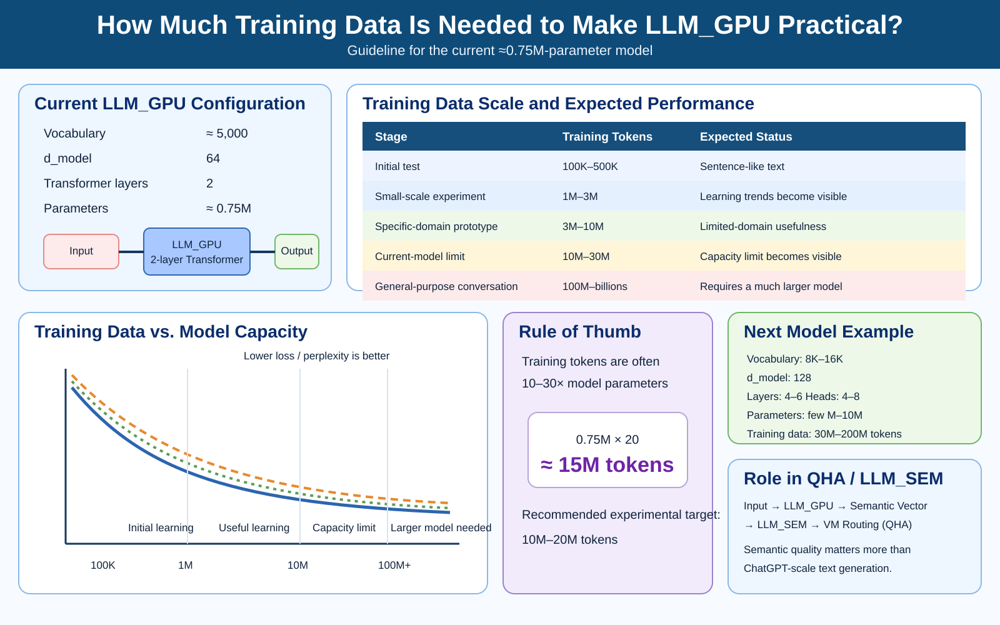

# LLM_GPU

CUDA/PyTorch GPU version of the homemade LLM project.

This repository is based on the architecture and end-to-end flow proven in
`digiponta/LLM` branch `v0.3`. The original educational virtual-GPU runtime
and hand-written backward propagation are replaced by real PyTorch tensors,
CUDA kernels, and PyTorch autograd.

## Architecture

```text
Japanese corpus
    |
character tokenizer
    |
Embedding
    |
Transformer blocks
    |-- LayerNorm
    |-- single-head causal Self-Attention
    |-- residual connection
    |-- LayerNorm
    |-- FFN (Linear -> GELU -> Linear)
    |-- residual connection
    |
final LayerNorm
    |
lm_head
    |
Cross Entropy
    |
PyTorch autograd
    |
AdamW
    |
CUDA GPU
```

## Files

```text
tokenizer.py          character tokenizer compatible with the original project
dataset.py            next-token dataset / uniform sampled windows
model.py              CUDA-capable Transformer language model
train.py              GPU training loop with progress and ETA
train_corpus.py       corpus pretraining entry point
train_conversation.py v0.5 conversational fine-tuning from the v0.4 checkpoint
chat.py               multi-turn conversational interface
evaluate_chat.py      deterministic conversational regression evaluation
infer.py              interactive raw GPU inference
check_gpu.py          CUDA/PyTorch diagnostic
prepare_wikipedia.py  Wikipedia dump -> plain text helper
requirements.txt      Python dependencies
```

## Installation

Install a CUDA-enabled PyTorch build suitable for the NVIDIA driver on the PC,
then install the project requirements.

```powershell
python -m pip install -r requirements.txt
python check_gpu.py
```

A successful setup reports:

```text
CUDA available : True
Device         : cuda
GPU            : NVIDIA ...
VRAM           : ... GiB
```

## Training data

By default the trainer looks for:

```text
data/general-ja.txt
data/data-nagato.txt
```

For convenience, if those files do not exist in this repository, it also
looks for the existing original-project files:

```text
../LLM/data/general-ja.txt
../LLM/data/data-nagato.txt
```

## Train

```powershell
python train_corpus.py
```

Default v0.4 long GPU run:

```text
context length : 64
d_model        : 64
layers         : 2
FFN dimension  : 256
attention heads: 1
batch size     : 64
samples        : 120,000,000
epochs         : 3
learning rate  : 5e-4
```

This sample count is estimated from the measured v0.3 benchmark on an
RTX 3070 Ti: 20,000 samples x 3 epochs took about 6 seconds. Linear scaling
gives approximately 120,000,000 samples x 3 epochs for a ten-hour run.

Actual runtime will vary with GPU clocks, thermals, system load, and I/O.
v0.4 computes sample positions on demand instead of allocating a huge Python
list, and DataLoader shuffling is disabled because the dataset itself uses a
deterministic pseudo-random corpus traversal.

Checkpoint:

```text
model/model-gpu-v0.4.pt
```

## Inference

```powershell
python infer.py
```

Generation uses temperature, top-k sampling, repetition penalty, and a bounded
context window.

## Relationship to the original v0.3

The original repository verified the complete path:

```text
corpus -> tokenizer -> model forward -> loss -> backward
       -> optimizer -> checkpoint -> reload -> inference
```

LLM_GPU preserves that path while moving tensor computation and gradient
calculation to a physical CUDA GPU.


---

## Note: Practical Training Data Scale for LLM_GPU

The following figure summarizes how much training data is needed to make the current **LLM_GPU** configuration practical.



### Current model

The current LLM_GPU configuration is approximately:

- Vocabulary: **~5,000**
- `d_model`: **64**
- Transformer layers: **2**
- Parameters: **~0.75M**

### Training scale guideline

| Stage | Training tokens (approx.) | Expected status |
|---|---:|---|
| Initial test | 100K–500K | Starts to generate sentence-like text |
| Small-scale experiment | 1M–3M | Learning behavior and loss trends become visible |
| Prototype for a specific domain | 3M–10M | May become useful for limited-domain tasks |
| Practical limit evaluation of the current model | 10M–30M | The capacity limit of the current architecture becomes visible |
| General-purpose conversational LLM | 100M–several billion | Requires a substantially larger model |

A useful rule of thumb is to train on roughly **10–30 times the number of model parameters**. For the current model:

```text
0.75M parameters × 20 ≈ 15M tokens
```

Therefore, **10M–20M tokens** is a good experimental target for the current LLM_GPU implementation.

If validation loss, perplexity, and generated-text quality stop improving significantly in the **10M–30M token** range, the bottleneck is likely to be **model capacity rather than data volume**.

### Suggested scale-up

A reasonable next model for comparison is:

- Vocabulary: **8,000–16,000**
- `d_model`: **128**
- Layers: **4–6**
- Heads: **4–8**
- Parameters: **a few million to ~10M**
- Training data: **30M–200M tokens**

This comparison is useful for determining whether the next limitation comes from **insufficient training data** or **insufficient model capacity**.

### Relevance to LLM_SEM and QHA

LLM_GPU does not necessarily need to become a large general-purpose conversational model. In the broader architecture, a more useful role is:

```text
Input Text
   ↓
LLM_GPU
   ↓
Semantic Vector
   ↓
LLM_SEM
   ↓
VM Routing (QHA)
```

For this use case, the main evaluation targets are:

- semantic representation quality,
- embedding stability,
- task-classification accuracy,
- routing quality for VM selection.

For QHA-oriented experiments, **10M–20M tokens of pretraining plus task-specific semantic data** can therefore be a meaningful practical target.

### Recommended next experiment

1. Train the current LLM_GPU model to about **10M tokens**.
2. Evaluate training loss, validation loss, perplexity, generated-text quality, and semantic representation quality.
3. Compare it with a larger model such as **`d_model=128` and 4 layers**.
4. Use the comparison to separate **data-scale limits** from **model-scale limits**.


---

## v0.5 Conversational Learning Experiment

v0.5 adds a second training stage for testing whether the existing sub-million-
parameter model can acquire basic short Japanese conversational behavior.

The design deliberately keeps the v0.4 architecture and tokenizer unchanged:

```text
general-ja.txt + data-nagato.txt
        |
        v
train_corpus.py
        |
        v
model-gpu-v0.4.pt
        |
        +---- data/conversation-ja.txt
        |
        v
train_conversation.py
        |
        v
model-gpu-v0.5-chat.pt
        |
        +---- chat.py
        |
        +---- evaluate_chat.py
```

### Conversation training data

The included compact corpus uses short role markers to save context:

```text
人: こんにちは。
AI: こんにちは。今日は何について話しましょうか。

人: GPUとは何ですか。
AI: 多数の計算を並列に処理するのが得意な演算装置です。
```

The current model has a context length of only 64 characters, so the examples
and expected replies are intentionally short.

### Step 1: prepare the v0.4 base model

If `model/model-gpu-v0.4.pt` and `model/tokenizer.json` already exist,
reuse them. Otherwise run:

```powershell
python train_corpus.py
```

### Step 2: conversational fine-tuning

```powershell
python train_conversation.py
```

Default fine-tuning settings (revised SFT):

```text
base checkpoint : model/model-gpu-v0.4.pt
conversation data: data/conversation-ja.txt
output checkpoint: model/model-gpu-v0.5-chat.pt
epochs (maximum): 40
learning rate   : 5e-5
batch size      : 16
validation ratio: 0.15
early-stop patience: 6
```

The revised trainer treats each `人:` / `AI:` pair as one supervised
training example. Cross-entropy loss is calculated only on the AI answer;
the user prompt and padding are masked out. This avoids the first v0.5
implementation's excessive repetition of a tiny continuous corpus, which
could produce a very low loss while still giving poor conversational replies.

The script keeps the existing tokenizer. It reports the percentage of
`<UNK>` tokens before training and warns when the conversation corpus contains
too many characters not represented by the v0.4 vocabulary.

Parameters can be changed from the command line, for example:

```powershell
python train_conversation.py --epochs 60 --learning-rate 5e-5 --patience 8
```

### Step 3: chat

```powershell
python chat.py
```

Commands:

```text
/reset   clear short conversation history
/exit    quit
```

The chat interface uses the same `人:` / `AI:` format as the fine-tuning
corpus and retains a small amount of dialogue history. The model still has a
64-character context limit, so long multi-turn conversation is not expected.

### Step 4: evaluate

```powershell
python evaluate_chat.py
```

The evaluation uses greedy decoding for reproducibility and reports:

- keyword hit rate on held-out prompts,
- percentage of non-empty replies,
- a simple repetition sanity check,
- mean reply length.

These are regression metrics for this experiment, not a claim of general
conversational intelligence. Generated replies should also be inspected
manually.

### Experiment objective

The v0.5 experiment asks:

> Can a sub-million-parameter Transformer acquire basic Japanese
> conversational behavior through dialogue-oriented fine-tuning?

A useful comparison is:

```text
v0.4 pretrained model
        vs.
v0.5 conversation-fine-tuned model
```

If v0.5 learns speaker turn-taking and short responses but factual coverage,
coherence, or multi-turn memory remain weak, the next bottleneck is likely the
small model capacity and 64-character context rather than the chat interface
itself.


### v0.5 SFT correction

The initial conversational experiment used a continuous next-character window
dataset with 50,000 repeated samples. A checkpoint loss near zero could
therefore indicate memorization rather than useful question-to-answer
behavior.

The revised implementation uses:

```text
one dialogue pair
      |
      v
人: <question>
AI: <answer>
      |
      +-- prompt tokens: loss masked
      |
      +-- AI answer tokens: loss enabled
      v
validation split + early stopping
```

`chat.py` was also changed to stop on the first generated newline or EOS,
use a lower default temperature, and apply repetition penalty only to tokens
already generated in the answer. This is especially important for questions
such as "GPUとは何ですか", because prompt words are no longer penalized when
the answer needs to reuse them.


---

## v0.6: Larger Conversational Model

v0.6 is the next experiment after the v0.5 conversational evaluation showed
that the 0.75M-parameter / context-64 model did not generalize reliably.

The v0.6 pipeline is:

```text
             general-ja + data-nagato
                       70%
                         \
conversation-ja 20% ---> Mixed Pretraining ---> v0.6 pretrained model
                         /
instruction-ja 10% -----+
                                |
                                v
                    Assistant-only SFT
                                |
                                v
                    model-gpu-v0.6-chat.pt
                         /              \
                        v                v
                    chat.py      evaluate_chat.py
```

### v0.6 architecture

```text
Vocabulary           : built from all mixed-training sources
d_model              : 128
Transformer layers   : 4
Attention heads      : 4
FFN dimension        : 512
Context length       : 256
Positional encoding  : learned positional embedding
Parameter scale      : approximately 2M+ (depends on vocabulary size)
```

The v0.6 model adds true multi-head causal attention and learned positional
embeddings. Older v0.4/v0.5 checkpoints remain readable because missing
`num_heads` and positional-embedding settings default to the legacy behavior.

### New files

```text
train_mixed.py          v0.6 70/20/10 mixed pretraining
train_sft_v06.py        v0.6 assistant-answer-only SFT
data/instruction-ja.txt compact Japanese instruction / QA corpus
```

The existing `chat.py` and `evaluate_chat.py` use the v0.6 tokenizer and
chat checkpoint by default on this branch.

### Stage 1: mixed pretraining

Required local corpora:

```text
data/general-ja.txt      or ../LLM/data/general-ja.txt
data/data-nagato.txt     or ../LLM/data/data-nagato.txt
data/conversation-ja.txt
data/instruction-ja.txt
```

Run:

```powershell
python train_mixed.py
```

Default configuration:

```text
mixture          : 70% general / 20% conversation / 10% instruction
samples          : 500,000
context          : 256
epochs           : 1
batch size       : 32
learning rate    : 3e-4
token exposures  : about 128M
```

Outputs:

```text
model/tokenizer-v0.6.json
model/model-gpu-v0.6-pretrain.pt
```

For a shorter first smoke test:

```powershell
python train_mixed.py --samples 20000
```

For a larger run:

```powershell
python train_mixed.py --samples 1000000 --epochs 1
```

### Stage 2: conversational SFT

After mixed pretraining:

```powershell
python train_sft_v06.py
```

Default SFT configuration:

```text
base checkpoint  : model/model-gpu-v0.6-pretrain.pt
tokenizer        : model/tokenizer-v0.6.json
context          : inherited from model (256)
epochs maximum   : 30
batch size       : 16
learning rate    : 2e-5
validation split : 15%
early stopping   : patience 5
```

The SFT loss is calculated only for assistant answer tokens:

```text
人: <user prompt>     -> masked from loss
AI: <assistant reply> -> optimized by cross entropy
```

Output:

```text
model/model-gpu-v0.6-chat.pt
```

### Stage 3: evaluation and chat

Evaluate first:

```powershell
python evaluate_chat.py
```

Then interact:

```powershell
python chat.py
```

The v0.6 chat defaults are less restrictive than v0.5 because the model has a
larger context and greater capacity:

```text
max new tokens     : 96
temperature        : 0.45
top-k              : 20
history turns      : 3
repetition penalty : 1.05
```

### Recommended experimental sequence

Do not start with the full mixed-pretraining run. First verify the complete
pipeline:

```powershell
python train_mixed.py --samples 20000
python train_sft_v06.py
python evaluate_chat.py
python chat.py
```

If the pipeline works correctly, delete or overwrite the smoke-test v0.6
checkpoints by running the normal mixed-pretraining command:

```powershell
python train_mixed.py
python train_sft_v06.py
python evaluate_chat.py
```

This provides a direct experimental comparison:

```text
v0.5
~0.75M params / context 64 / 1 head
                  versus
v0.6
~2M+ params / context 256 / 4 heads / positional embedding
/ mixed pretraining / assistant-only SFT
```


### v0.6 conversational-quality correction

After the first v0.6 smoke evaluation improved the keyword hit rate but still
showed phrase collapse such as malformed Japanese and repeated high-frequency
phrases, the training pipeline was revised.

The mixed-pretraining schedule is now curriculum-based:

```text
first 80% of samples:
  90% general / 7% conversation / 3% instruction

last 20% of samples:
  70% general / 20% conversation / 10% instruction
```

This prevents the very small dialogue and instruction corpora from dominating
before the base Japanese language distribution is learned.

The v0.6 SFT stage now combines:

```text
conversation-ja.txt
        +
instruction-ja.txt converted to user/assistant pairs
        |
        v
deduplication
        |
assistant-only loss
        |
label smoothing = 0.05
        |
early stopping
```

The default SFT learning rate was reduced from `2e-5` to `1e-5` to reduce
damage to the mixed-pretrained language model.

Because the tokenizer vocabulary and the pretraining distribution changed,
old v0.6 checkpoints should not be reused after this correction. Retrain from
the beginning:

```powershell
Remove-Item model\model-gpu-v0.6-pretrain.pt -ErrorAction SilentlyContinue
Remove-Item model\model-gpu-v0.6-chat.pt -ErrorAction SilentlyContinue
Remove-Item model\tokenizer-v0.6.json -ErrorAction SilentlyContinue

python train_mixed.py --samples 20000
python train_sft_v06.py
python evaluate_chat.py
```

If the corrected smoke test is sound, proceed to the full run with
`python train_mixed.py`.


---

## v0.7: Byte-level BPE Tokenizer Experiment

v0.7 keeps the successful v0.6 Transformer architecture and changes the main
experimental variable from character-level tokenization to byte-level BPE.

The motivation is the remaining v0.6 failure mode where semantically related
Japanese strings can still be confused at the character level. BPE can learn
multi-character units such as frequently occurring Japanese expressions,
technical terms, and response fragments while byte-level fallback keeps the
tokenizer robust for previously unseen Unicode text.

### v0.7 architecture

```text
Tokenizer             : byte-level BPE
Target vocabulary     : 8,000
d_model               : 128
Transformer layers    : 4
Attention heads       : 4
FFN dimension         : 512
Context length        : 256 subword tokens
Positional embedding  : learned
Mixed pretraining     : curriculum
SFT                   : assistant-only + label smoothing
```

The Transformer dimensions deliberately remain the same as v0.6 so the
tokenizer effect can be compared more directly.

### New files

```text
tokenizer_bpe.py       byte-level BPE wrapper
train_mixed_v07.py     v0.7 BPE curriculum pretraining
train_sft_v07.py       v0.7 BPE conversational/instruction SFT
```

The original `tokenizer.py`, `train_mixed.py`, and
`train_sft_v06.py` remain in the repository so the v0.6 experiment is
reproducible.

### Dependency

v0.7 adds Hugging Face `tokenizers`:

```powershell
python -m pip install -r requirements.txt
```

### Important: v0.6 checkpoints cannot be reused

A tokenizer change changes the vocabulary IDs and embedding/output dimensions.
Therefore v0.7 must be trained from scratch.

v0.7 uses separate files:

```text
model/tokenizer-v0.7-bpe.json
model/model-gpu-v0.7-pretrain.pt
model/model-gpu-v0.7-chat.pt
```

### Smoke test

```powershell
git checkout v0.7
git pull
python -m pip install -r requirements.txt

python train_mixed_v07.py --samples 20000
python train_sft_v07.py
python evaluate_chat.py
python chat.py
```

During pretraining the script reports `Chars/token`. With character-level
tokenization this value is effectively near 1 character per token; a value
above 1 for v0.7 indicates that BPE has learned multi-character units.

### Full experiment

After the complete smoke-test pipeline works:

```powershell
python train_mixed_v07.py
python train_sft_v07.py
python evaluate_chat.py
python chat.py
```

Default pretraining remains 500,000 samples, context 256, batch size 32, and
one epoch, preserving the v0.6 curriculum:

```text
Phase A (first 80%):
  90% general / 7% conversation / 3% instruction

Phase B (last 20%):
  70% general / 20% conversation / 10% instruction
```

### BPE-aware generation

With BPE, a newline or role marker may span multiple token IDs. The v0.7
`chat.py` therefore no longer assumes that newline is one token. It decodes
the generated subword sequence incrementally and stops at textual newline /
role boundaries.

### Comparison target

```text
v0.6:
  character tokenizer
  500k curriculum pretraining
  evaluation: 7/10 keyword hits

v0.7:
  byte-level BPE tokenizer
  same Transformer dimensions
  same curriculum/SFT concept
  evaluation: to be measured
```

The key v0.7 questions are:

1. Does BPE improve Japanese sentence stability?
2. Does it reduce intent confusion for paraphrased prompts?
3. Does the same context length carry more semantic content because common
   multi-character sequences become single tokens?
4. Does evaluation improve beyond the v0.6 70% result without increasing the
   Transformer depth or width?


### v0.7.1 targeted refinement

After v0.7 reached 9/10 on the original conversational regression set, the
remaining clear semantic error was confusion among closely related technical
terms (for example GPU versus LLM). The v0.7 branch therefore adds a targeted
refinement without changing model width, depth, context length, or tokenizer.

Changes:

- added contrastive paraphrases for GPU / CPU / LLM / Transformer / CUDA /
  Python,
- added explicit "X is not Y" distinction examples,
- changed SFT validation from a global random split to an intent-stratified
  split,
- reduced default SFT label smoothing from 0.05 to 0.02,
- kept the original 10-case regression benchmark,
- added a separate six-case Technical contrast diagnostic.

Because the BPE tokenizer was trained before these new examples were added,
two experiment modes are possible.

For the fastest targeted refinement, reuse the existing v0.7 pretrained BPE
checkpoint and rerun only SFT:

```powershell
git checkout v0.7
git pull
python train_sft_v07.py
python evaluate_chat.py
```

For a fully controlled v0.7.1-style experiment in which the BPE vocabulary and
mixed pretraining also see the new technical examples, retrain from scratch:

```powershell
Remove-Item model\tokenizer-v0.7-bpe.json -ErrorAction SilentlyContinue
Remove-Item model\model-gpu-v0.7-pretrain.pt -ErrorAction SilentlyContinue
Remove-Item model\model-gpu-v0.7-chat.pt -ErrorAction SilentlyContinue

python train_mixed_v07.py
python train_sft_v07.py
python evaluate_chat.py
```

The second procedure is the clean comparison against the previous v0.7 result.

### Semantic-aware evaluation correction

The original v0.7 regression evaluator counted a case as PASS when any one
keyword appeared. This could produce a false positive, for example:

```text
Prompt: GPUは何をするものですか。
Reply : GPUはコンピュータ全体の汎用的な処理を担当する演算装置です。
```

The reply contains the string `GPU`, but semantically describes a CPU.

The evaluator now uses two rules:

1. every required semantic group must match at least one synonym;
2. no forbidden/conflicting phrase may appear.

For example, the GPU case now requires both:

```text
GPU
AND
one of: 並列 / 多数の計算 / 大量の計算
```

and rejects CPU-like descriptions such as:

```text
汎用的な処理を担当
命令実行
```

The summary metric is therefore now:

```text
Semantic pass rate
```

and the technical diagnostic reports:

```text
Technical semantic rate
```

This is still a lightweight rule-based regression test rather than a general
semantic benchmark, but it avoids the main false-PASS failure found in the
previous keyword-only evaluation.


### Final v0.7 generalization hardening

The final v0.7 refinement addresses two separate goals:

1. reduce the local GPU/CPU confusion with symmetric training paraphrases;
2. measure true paraphrase generalization on prompts not present in SFT data.

Training data now contains balanced GPU/CPU examples covering role, strengths,
parallel versus sequential processing, and explicit contrast. The wording is
kept different from the generalization benchmark.

A new independent evaluator is available:

```powershell
python evaluate_generalization_v07.py
```

It contains 30 held-out prompts spanning:

- GPU / CPU and technical contrasts,
- LLM / Transformer / CUDA / Python,
- short-answer / topic-change / repeat / conversation-end controls,
- debugging and research comparison,
- simple facts and conversational intents.

The script reports:

```text
Generalization semantic rate: ?/30
Per-intent:
...
```

For this final refinement, the existing BPE tokenizer and mixed-pretrained
checkpoint may be reused because the vocabulary and architecture are unchanged.
Only SFT needs to be rerun:

```powershell
git pull
python train_sft_v07.py
python evaluate_chat.py
python evaluate_generalization_v07.py
```

For publication-quality comparison, keep both scores: the original regression
set measures regression stability, while the held-out set measures paraphrase
generalization.

### v0.7 augmented SFT + intent multi-task learning

The final v0.7 SFT now addresses the weak 7/30 held-out paraphrase result with
two complementary mechanisms.

#### 1. Deterministic SFT data augmentation

`augment_sft_v07.py` expands the original conversation/instruction pairs with
intent-specific Japanese paraphrase templates. The default setting generates up
to 24 variants per supported intent family.

Covered intents include:

```text
GPU, CPU, LLM, Transformer, CUDA, Python
short answer, topic change, repeat explanation, conversation end
debug/error, research comparison
greeting, fatigue, thanks, Japan capital
```

The augmentation is deterministic and requires no external API or LLM.
The 30 held-out prompts in `evaluate_generalization_v07.py` were checked
against the augmentation templates; there are no exact prompt overlaps.

#### 2. Intent multi-task learning

SFT now optimizes two objectives simultaneously:

```text
total_loss
  = assistant_language_model_loss
  + 0.25 * intent_classification_loss
```

The intent classifier reads the final hidden representation at the end of the
user/assistant prompt prefix. Its gradients also update the base Transformer,
encouraging semantically similar paraphrases to occupy intent-consistent
representations.

The classifier head is used only during training. Normal chat inference still
uses the same v0.7 language-model architecture and checkpoint format.

A separate diagnostic head is saved as:

```text
model/model-gpu-v0.7-intent-head.pt
```

The chat model remains:

```text
model/model-gpu-v0.7-chat.pt
```

#### Training

The existing v0.7 BPE tokenizer and mixed-pretrained checkpoint can be reused:

```powershell
git checkout v0.7
git pull

python train_sft_v07.py
python evaluate_chat.py
python evaluate_generalization_v07.py
```

Default multi-task SFT settings:

```text
variants per intent : 24
intent loss weight  : 0.25
label smoothing     : 0.02
learning rate       : 1e-5
max epochs          : 30
early stopping      : patience 5
```

Training now reports both language-model and intent metrics:

```text
train=... lm=... intent=... intent_acc=...
val=...   lm=... intent=... intent_acc=...
```

Note that the saved checkpoint loss is now the combined validation objective,
so it should not be compared directly with older answer-only SFT loss values.

The key v0.7 success criteria are now:

```text
Regression semantic rate       : preserve the previous high score
Technical semantic rate        : preserve 6/6 if possible
Generalization semantic rate   : improve substantially beyond 7/30
```

### v0.7 multi-label intent learning

The intent auxiliary task has been upgraded from one-label classification to
multi-label semantic tagging.

A prompt may now carry several tags simultaneously. Example:

```text
CPUとGPUのどちらが並列計算向きですか。

tags:
  tech_cpu
  tech_gpu
  relation_compare
  relation_distinction
  property_parallel
```

Another example:

```text
LLMとTransformerは同じ意味ですか。

tags:
  tech_llm
  tech_transformer
  relation_compare
  relation_distinction
```

The auxiliary classifier therefore uses a multi-hot target and
`BCEWithLogitsLoss` instead of single-class cross entropy.

Because most tags are absent from any one prompt, positive-class weights are
computed from the training split and capped at 10.0 to reduce all-zero bias.
Training reports multi-label micro-F1 rather than ordinary class accuracy.

```text
total_loss
  = assistant LM loss
  + 0.25 * weighted multi-label BCE loss
```

Additional relation-oriented augmentation covers CPU/GPU, LLM/Transformer,
CUDA/GPU, and Python/CUDA comparisons. These relation prompts were checked
against the 30 held-out generalization prompts; there are no exact overlaps.

Run:

```powershell
git checkout v0.7
git pull

python train_sft_v07.py
python evaluate_chat.py
python evaluate_generalization_v07.py
```

Expected training diagnostics now include:

```text
Intent tags        : ...
Positive weights   : min=... max=...
train=... lm=... intent=... tag_f1=...
val=...   lm=... intent=... tag_f1=...
```

The intent head remains auxiliary. Normal `chat.py` inference continues to
use only the language model checkpoint.

## v0.8: Capacity Scaling Experiment

v0.8 tests whether the remaining v0.7 generalization ceiling is primarily a
model-capacity limitation.

The tokenizer, SFT data, augmentation logic, multi-label intent objective, and
held-out 30-case generalization benchmark are retained. The main change is the
Transformer capacity.

### Architecture

```text
                     v0.7            v0.8
Tokenizer            BPE 8k          same v0.7 BPE
d_model              128             256
Layers               4               6
Attention heads      4               8
FFN dimension        512             1024
Context length       256             512
SFT objective        multi-label     multi-label
```

v0.8 intentionally reuses:

```text
model/tokenizer-v0.7-bpe.json
```

so tokenization does not become another experimental variable.

v0.8 writes separate checkpoints:

```text
model/model-gpu-v0.8-pretrain.pt
model/model-gpu-v0.8-chat.pt
model/model-gpu-v0.8-intent-head.pt
```

### RTX 3070 Ti defaults

Because attention memory grows strongly with context length, the default batch
sizes are reduced:

```text
pretraining batch size : 16
SFT batch size         : 8
```

If CUDA runs out of memory, reduce them further:

```powershell
python train_mixed_v08.py --batch-size 8
python train_sft_v08.py --batch-size 4
```

### Smoke test

Before the full run:

```powershell
git checkout v0.8
git pull

python train_mixed_v08.py --samples 20000
python train_sft_v08.py
python evaluate_chat.py
python evaluate_generalization_v07.py
```

### Full experiment

After the smoke test succeeds, rerun pretraining at the normal scale:

```powershell
python train_mixed_v08.py
python train_sft_v08.py
python evaluate_chat.py
python evaluate_generalization_v07.py
python chat.py
```

The 30 held-out prompts are unchanged from v0.7. The primary comparison is:

```text
v0.7 multi-label generalization : 16/30 = 53.3%
v0.8 larger model               : to be measured
```

The experiment asks whether increasing width, depth, attention heads, and
context can improve unseen paraphrase generalization while preserving the
existing regression and technical-semantic scores.

Note: v0.8 uses a 512-token context during pretraining, so token exposure per
sample is twice that of the 256-token v0.7 setup. Therefore the experiment is
best interpreted as a practical capacity-and-context scaling test rather than a
perfect single-variable parameter-count ablation.

### v0.8 technical concept binding refinement

After v0.8 reached 19/30 (63.3%) on the fixed held-out generalization set,
the architecture is kept unchanged and only technical concept binding is
refined.

The target concepts are:

```text
GPU
CPU
LLM
Transformer
CUDA
Python
```

The refinement uses matched minimal-pair prompt structures. Each concept is
trained with the same question forms, while the canonical answer changes with
the concept. Canonical answers explicitly repeat the concept name so the model
must bind the entity to its defining property rather than emit only a generic
property phrase.

Example pattern:

```text
GPUの中心的な役割を説明してください。
→ GPUの中心的な役割は大量の並列計算を効率よく処理することです。

CPUの中心的な役割を説明してください。
→ CPUの中心的な役割は多様な命令を実行し、汎用処理を制御することです。

LLMの中心的な役割を説明してください。
→ LLMの中心的な役割は言語を理解し、文章を生成することです。

Transformerの中心的な役割を説明してください。
→ Transformerの中心的な役割はAttentionで情報間の関係を処理することです。
```

Technical rows are also oversampled in the training split only:

```text
--technical-repeat 3
```

Validation rows are not duplicated. This keeps the validation distribution
unchanged while giving the six technical concepts stronger gradient exposure.

No architecture constants were changed:

```text
d_model       : 256
layers        : 6
heads         : 8
FFN           : 1024
context       : 512
tokenizer     : fixed v0.7 BPE
```

The new minimal-pair prompts were checked against both the fixed regression set
and the 30-case held-out generalization set; there are no exact prompt
overlaps.

Because only SFT data weighting and augmentation changed, v0.8 pretraining does
not need to be repeated. Run:

```powershell
git checkout v0.8
git pull

python train_sft_v08.py
python evaluate_chat.py
python evaluate_generalization_v07.py
```

The baseline to beat remains:

```text
v0.8 before binding refinement: 19/30 = 63.3%
```

For an ablation, the training-only technical emphasis can be changed without
modifying the data:

```powershell
python train_sft_v08.py --technical-repeat 1
python train_sft_v08.py --technical-repeat 2
python train_sft_v08.py --technical-repeat 3
```

`1` disables technical oversampling; `3` is the default.

### v0.8 multidimensional generalization evaluation

The fixed 30-case generalization benchmark now separates several failure modes
instead of collapsing every case into one PASS/MISS result.

For each reply, the evaluator reports:

```text
semantic-content
entity
fluency
strict
```

Definitions:

```text
semantic-content
  Checks the answer's required meaning while allowing a concept name to be
  omitted when that same concept is already explicit in the user prompt.

entity
  Checks whether prompt-mentioned technical entities are explicitly repeated
  in the answer. This distinguishes "the meaning is correct but the name was
  omitted" from a true semantic error.

fluency
  Flags obvious surface corruption such as replacement characters, long
  malformed ASCII fragments, underscore noise, and repeated fragments.
  It is intentionally conservative and is not a general grammar judge.

strict
  PASS only when semantic-content, entity explicitness, and fluency all pass.
```

The original rule-based score is retained as:

```text
Legacy rule rate
```

so older v0.7/v0.8 experiment results remain comparable.

Example:

```text
Prompt: GPU is suitable for many simultaneous calculations. What is it good at?
Reply : Large-scale parallel computation.

semantic-content : PASS
entity           : MISS
fluency          : PASS
strict           : MISS
legacy           : MISS
```

This avoids treating a concept-name omission as the same failure type as an
incorrect answer such as confusing GPU with CPU.

Run the evaluator as before:

```powershell
python evaluate_generalization_v07.py
```

The summary now reports:

```text
Semantic-content rate
Entity-explicit rate
Fluency rate
Strict composite rate
Legacy rule rate
```

The 30 prompts themselves are unchanged.

### v0.8 evaluator refinement: semantic slots and entity N/A

The multidimensional evaluator has been tightened without changing any of the
30 held-out prompts.

#### Tri-state entity scoring

Entity explicitness now uses three states:

```text
PASS  concept name was expected and explicitly present
MISS  concept name was expected but omitted
N/A   explicit entity repetition is not applicable
```

`N/A` is used when the prompt does not already name the entity and the task is
to identify it. It does not count as a failure in the strict composite score.

This prevents conversational, debugging, comparison, and name-identification
questions from artificially inflating the entity-explicit rate.

#### Stronger semantic slots

Selected cases now require multiple semantic slots instead of passing from one
broad keyword OR-group.

Examples:

```text
Transformer:
  Transformer
  AND Attention
  AND structure/model/neural-network category

CUDA:
  CUDA
  AND GPU
  AND technology/mechanism/general-computing category

Python:
  Python
  AND language category

Comparison:
  comparison/difference action
  AND common conditions/metrics
```

This specifically prevents malformed outputs that happen to contain a word such
as `条件` from being counted as semantically correct.

The summary remains backward compatible and reports:

```text
Semantic-content rate
Entity-explicit rate (applicable cases only, with N/A count)
Fluency rate
Strict composite rate
Legacy rule rate
```

Run:

```powershell
git checkout v0.8
git pull
python evaluate_generalization_v07.py
```

### v0.8 reverse-definition binding

The v0.8 architecture and the fixed 30-case evaluator remain unchanged.
This refinement targets semantic reverse lookup: infer the concept name from a
description that does not explicitly contain the name.

Fifteen training rows were added for the weak concepts:

```text
GPU
CPU
Transformer
CUDA
Python
```

Examples:

```text
Attentionを主要な仕組みとして文脈中の情報関係を扱うモデル構造は何ですか。
→ Transformerです。TransformerはAttentionを中心に文脈を処理するモデル構造です。

NVIDIAのGPUを一般的な計算処理に利用するための計算基盤は何ですか。
→ CUDAです。CUDAはNVIDIA GPUを汎用計算に利用するための技術です。

読みやすい文法と幅広い用途で知られる汎用プログラミング言語は何ですか。
→ Pythonです。Pythonは読みやすい文法を持つ汎用プログラミング言語です。
```

Two hard-negative CPU/GPU selection examples are also included so that the
same comparison structure leads to opposite answers depending on the semantic
property.

The reverse-definition prompts have no exact prompt overlap with the fixed
30-case generalization benchmark.

To isolate this refinement from the previous oversampling experiment,
`--technical-repeat` now defaults to:

```text
1
```

which disables broad technical oversampling. The architecture is unchanged:

```text
d_model       : 256
layers        : 6
heads         : 8
FFN           : 1024
context       : 512
tokenizer     : fixed v0.7 BPE
```

Pretraining does not need to be repeated. Run only SFT and evaluation:

```powershell
git checkout v0.8
git pull

python train_sft_v08.py
python evaluate_chat.py
python evaluate_generalization_v07.py
```

The refined evaluator should be used for comparison. The current pre-refinement
baseline is:

```text
Semantic-content : 18/30 = 60.0%
Strict composite : 16/30 = 53.3%
Fluency          : 29/30 = 96.7%
```

### v0.8 reverse-definition + replay balancing

The reverse-definition refinement improved the multidimensional benchmark to:

```text
Semantic-content : 20/30 = 66.7%
Strict composite : 20/30 = 66.7%
Fluency          : 30/30 = 100.0%
```

However, debug/error and some conversational-control intents regressed. To
reduce this interference without changing the architecture, v0.8 now adds
training-only replay balancing.

Protected replay tags:

```text
debug_error
control_repeat
control_topic
```

Default replay factor:

```text
--replay-repeat 2
```

This means one extra training copy is added for protected rows. Validation rows
are not replayed.

Broad technical oversampling remains disabled:

```text
--technical-repeat 1
```

so the experiment isolates:

```text
reverse-definition binding
+
small replay of regressed nontechnical intents
```

The repeat-intent tagger was also tightened. The generic word `説明` is no
longer sufficient to assign `control_repeat`, preventing ordinary technical
"explain X" prompts from being accidentally replayed as repeat-control data.

The v0.8 architecture remains unchanged:

```text
d_model       : 256
layers        : 6
heads         : 8
FFN           : 1024
context       : 512
tokenizer     : fixed v0.7 BPE
```

Pretraining does not need to be repeated:

```powershell
git checkout v0.8
git pull

python train_sft_v08.py
python evaluate_chat.py
python evaluate_generalization_v07.py
```

For ablation:

```powershell
python train_sft_v08.py --replay-repeat 1
python train_sft_v08.py --replay-repeat 2
python train_sft_v08.py --replay-repeat 3
```

`1` disables replay; `2` is the new default.

### v0.8 pairwise hard-negative binding

The v0.8 architecture, reverse-definition rows, replay balancing, and fixed
30-case generalization benchmark are retained. This refinement adds pairwise
hard-negative training for the remaining confused concepts.

Target pairs:

```text
GPU <-> CPU
Transformer <-> CUDA
CUDA <-> Python
```

Twelve new training rows use matched question structures with opposite semantic
properties. The model must choose the correct concept and explain the property
that distinguishes it from the competing concept.

Examples:

```text
CPUとGPUのうち、大量の同種計算を並列に処理する側は?
-> GPU. Parallel computation.

CPUとGPUのうち、多様な命令実行や汎用制御を主に担当する側は?
-> CPU. General-purpose processing/control.

TransformerとCUDAのうち、Attentionを中心に情報関係を処理する構造は?
-> Transformer.

TransformerとCUDAのうち、NVIDIA GPUを汎用計算に使う技術は?
-> CUDA.

CUDAとPythonのうち、GPU計算技術は?
-> CUDA.

CUDAとPythonのうち、汎用プログラミング言語は?
-> Python.
```

The prompts are paired deliberately so that the surface form stays similar
while the semantic property changes the correct answer. This is intended to
strengthen entity-property binding rather than simply increase exposure to one
technical term.

The CUDA/GPU relation is also now tagged as `relation_compare`, making the
multi-label auxiliary task more consistent with the other technical pairs.

No exact prompt overlap was found between the new pairwise rows and the fixed
30-case generalization benchmark.

Training defaults remain:

```text
--technical-repeat 1
--replay-repeat 2
```

and the architecture remains unchanged:

```text
d_model       : 256
layers        : 6
heads         : 8
FFN           : 1024
context       : 512
tokenizer     : fixed v0.7 BPE
```

Pretraining does not need to be repeated:

```powershell
git checkout v0.8
git pull

python train_sft_v08.py
python evaluate_chat.py
python evaluate_generalization_v07.py
```

The baseline immediately before this refinement is:

```text
Semantic-content : 21/30 = 70.0%
Strict composite : 21/30 = 70.0%
Fluency          : 30/30 = 100.0%

GPU             : 3/3
CPU             : 2/3
GPU/CPU         : 0/2
Transformer     : 0/1
CUDA            : 0/1
Python          : 0/1
```

## v0.9 intent-head diagnostic

Before changing the generation architecture, v0.9 adds:

```text
evaluate_intent_v09.py
```

The script runs the same fixed 30 generalization prompts and compares:

```text
expected intent tags
predicted intent tags
top intent probabilities
current generated answer
```

It loads:

```text
model/model-gpu-v0.8-chat.pt
model/model-gpu-v0.8-intent-head.pt
model/tokenizer-v0.7-bpe.json
```

and reports:

```text
Expected-tag case recall
Exact tag-set match
Micro precision
Micro recall
Micro F1
Per-intent expected-tag recall
```

The diagnostic purpose is to distinguish two cases:

```text
intent tags correct + answer wrong
    -> intent recognition exists, but generation does not directly use it

intent tags wrong + answer wrong
    -> improve intent representation/training before conditioning generation
```

Run:

```powershell
git checkout v0.9
git pull
python evaluate_intent_v09.py
```

The default intent threshold is read from the saved intent-head checkpoint.
It can be overridden for diagnosis:

```powershell
python evaluate_intent_v09.py --threshold 0.4
```

## v0.9 soft Intent-Conditioned Generation

v0.9 now implements soft intent conditioning without hard thresholding.

The conditioning path is:

```text
Prompt
  -> frozen v0.8 Transformer
  -> prompt hidden state
  -> frozen multi-label Intent Head
  -> sigmoid probabilities (24 dims)
  -> zero-initialized Linear(24 -> 256)
  -> alpha * intent bias
  -> add to LM hidden state
  -> frozen LM head
  -> answer
```

The first v0.9 experiment is intentionally projection-only. The v0.8
pairwise-best language model and its intent head are frozen, and only the small
intent projection is trained. This isolates the effect of the new
intent-to-generation path and reduces catastrophic regression risk.

Defaults:

```text
base model   : model/model-gpu-v0.8-chat-pairwise-best.pt
intent head  : model/model-gpu-v0.8-intent-head.pt
projection   : model/model-gpu-v0.9-soft-intent.pt
alpha        : 0.1
projection   : 24 -> 256
initialization: zero (exact no-op at step zero)
learning rate: 1e-3
epochs       : 20
```

No threshold is used for generation conditioning:

```python
intent_prob = sigmoid(intent_logits)
intent_bias = alpha * projection(intent_prob)
conditioned_hidden = hidden + intent_bias
```

This preserves confidence information such as a 0.46 Python score versus a
0.19 short-control score instead of converting both into hard ON/OFF tags.

Train only the v0.9 projection:

```powershell
git checkout v0.9
git pull

python train_sft_v09.py
```

Then run the unchanged 30-case benchmark through the new generation path:

```powershell
python evaluate_generalization_v09.py
```

Interactive chat:

```powershell
python chat_v09.py
```

The comparison baseline is the saved v0.8 pairwise-best checkpoint:

```text
Semantic-content : 22/30 = 73.3%
Strict composite : 22/30 = 73.3%
Fluency          : 30/30 = 100.0%
```

A useful success condition is improvement on cases where the intent head was
already correct but generation failed (for example GPU/CPU general-processing,
topic/repeat/end controls), without regressing the stable GPU, error, compare,
CUDA/GPU, and LLM/Transformer cases.

### v0.9 inference-time alpha sweep

The trained soft-intent projection can now be evaluated at multiple inference
strengths without retraining.

Run:

```powershell
git checkout v0.9
git pull

python evaluate_alpha_sweep_v09.py
```

Default sweep:

```text
alpha = 0.0, 0.1, 0.25, 0.5, 1.0
```

All values reuse the same:

```text
v0.8 pairwise-best base model
v0.8 intent head
v0.9 trained projection weights
fixed 30-case generalization benchmark
greedy generation settings
```

Only `projection.alpha` changes at inference time.

The script reports:

```text
overall semantic / strict / entity / fluency / legacy scores
strict delta versus alpha=0.0
which cases improved
which cases regressed
which replies changed
per-intent strict comparison
best observed alpha(s)
```

To print every generated reply for every alpha:

```powershell
python evaluate_alpha_sweep_v09.py --show-cases
```

Custom sweep values are also supported:

```powershell
python evaluate_alpha_sweep_v09.py --alphas 0 0.05 0.1 0.2 0.5 1.0
```

This is an inference-strength ablation only. The projection was trained at
alpha=0.1, so results at other alpha values measure post-training scaling, not
separately optimized projection checkpoints.

### v0.9 Mid-Layer Intent Conditioning

The inference-time alpha sweep showed no score change from alpha=0.0 through
1.0 for the final-layer soft-intent method. v0.9 therefore adds a second,
cleanly separated conditioning path that injects the soft intent signal inside
the Transformer instead of immediately before the LM head.

Default path:

```text
Prompt
  -> frozen v0.8 Transformer prompt representation
  -> frozen multi-label Intent Head
  -> sigmoid probabilities (24 dims)
  -> zero-initialized Linear(24 -> 256)
  -> alpha * intent embedding
  -> Transformer Block 1
  -> Transformer Block 2
  -> Transformer Block 3
  -> ADD intent embedding
  -> Transformer Block 4
  -> Transformer Block 5
  -> Transformer Block 6
  -> final norm
  -> LM head
```

The base language model and intent head remain frozen. Only the 24 -> 256
projection is trained. This preserves the v0.8 pairwise-best checkpoint while
allowing Blocks 4-6 to transform the injected semantic signal.

Defaults:

```text
base model    : model/model-gpu-v0.8-chat-pairwise-best.pt
intent head   : model/model-gpu-v0.8-intent-head.pt
projection    : model/model-gpu-v0.9-mid-intent.pt
inject-after  : 3
alpha         : 0.1
learning rate : 1e-3
epochs        : 20
```

The projection is zero-initialized, so the initial conditioned path is an exact
no-op before training.

Train:

```powershell
git checkout v0.9
git pull

python train_mid_intent_v09.py
```

Evaluate on the unchanged 30-case benchmark:

```powershell
python evaluate_mid_intent_v09.py
```

Interactive chat:

```powershell
python chat_mid_intent_v09.py
```

The main baseline remains:

```text
Semantic-content : 22/30 = 73.3%
Strict composite : 22/30 = 73.3%
```

The key cases are the prompts where intent recognition was already correct but
generation failed, especially G14, G15, G18, and G28. Improvement there would
support the hypothesis that the intent signal needs to enter the Transformer
before the final LM head.

### v0.9 Partial Fine-Tuning

The projection-only mid-layer experiment remained at the same 22/30 strict
score as the v0.8 baseline. v0.9 therefore adds partial fine-tuning so the
Transformer layers after the injection point can learn how to use the intent
signal.

Architecture:

```text
Frozen intent path
------------------
v0.8 pairwise-best model
  -> frozen intent head
  -> sigmoid probabilities (24 dims)

Generation path
---------------
Blocks 1-3      : frozen
Intent projection 24 -> 256 : trainable
Inject after Block 3
Blocks 4-6      : trainable
FinalNorm       : trainable
LM Head         : frozen
```

The intent path uses a separate frozen copy of the v0.8 model. This keeps the
intent-head input distribution fixed while the generation-side Blocks 4-6 are
adapted.

Default learning rates:

```text
Intent projection : 1e-3
Blocks 4-6        : 2e-6
FinalNorm         : 2e-6
LM Head           : frozen
```

Default checkpoint:

```text
model/model-gpu-v0.9-partial-intent.pt
```

Train:

```powershell
git checkout v0.9
git pull

python train_partial_intent_v09.py
```

Evaluate on the unchanged 30-case benchmark:

```powershell
python evaluate_partial_intent_v09.py
```

Interactive chat:

```powershell
python chat_partial_intent_v09.py
```

The comparison baseline remains:

```text
Semantic-content : 22/30 = 73.3%
Strict composite : 22/30 = 73.3%
```

The first success criterion is improvement on G14, G15, G18, and G28 without
regressing the already stable GPU, error, comparison, CUDA/GPU, and
LLM/Transformer cases.

### v0.9 Partial Fine-Tuning block-LR sweep

The partial fine-tuning experiment can now be swept automatically across:

```text
2e-6
5e-6
1e-5
2e-5
```

while keeping:

```text
projection LR : 1e-3
alpha         : 0.1
inject-after  : Block 3
LM Head       : frozen
benchmark     : same fixed 30 cases
```

Run the complete sweep:

```powershell
git checkout v0.9
git pull

python run_partial_lr_sweep_v09.py
```

For each block learning rate the script:

```text
1. trains an independent partial-intent checkpoint
2. evaluates it on the same 30-case benchmark
3. saves training and evaluation logs
4. records validation loss and evaluation metrics
5. prints an overall and per-intent comparison
```

Independent checkpoints are written as:

```text
model/model-gpu-v0.9-partial-intent-blocklr-2e-6.pt
model/model-gpu-v0.9-partial-intent-blocklr-5e-6.pt
model/model-gpu-v0.9-partial-intent-blocklr-1e-5.pt
model/model-gpu-v0.9-partial-intent-blocklr-2e-5.pt
```

Logs and CSV summary are written under:

```text
results/partial_lr_sweep_v09/
```

including:

```text
partial_lr_sweep_v09.csv
```

To print the full child-process output during the sweep:

```powershell
python run_partial_lr_sweep_v09.py --show-output
```

To re-evaluate existing sweep checkpoints without retraining:

```powershell
python run_partial_lr_sweep_v09.py --skip-training
```

The primary comparison remains the v0.8 pairwise-best baseline:

```text
Strict composite : 22/30 = 73.3%
Semantic-content : 22/30 = 73.3%
```

The experiment tests whether the unchanged 22/30 ceiling is due to insufficient
adaptation strength in Blocks 4-6, or whether the current intent representation
and training data are the more likely bottleneck.

### v0.9 local block-LR refinement

After the coarse Partial Fine-Tuning sweep, the first improvement beyond the
22/30 ceiling was observed at:

```text
block LR : 1e-5
strict   : 23/30 = 76.7%
```

The next experiment narrows the search around that point:

```text
7.5e-6
1.0e-5
1.25e-5
1.5e-5
```

Run:

```powershell
git checkout v0.9
git pull

python run_partial_lr_local_sweep_v09.py
```

The wrapper reuses the same training and fixed 30-case evaluation pipeline and
writes its results separately under:

```text
results/partial_lr_local_sweep_v09/
```

Checkpoint filenames now preserve fractional scientific-notation values without
collisions, for example:

```text
7.5e-6  -> model-gpu-v0.9-partial-intent-blocklr-7p5e-6.pt
1.25e-5 -> model-gpu-v0.9-partial-intent-blocklr-1p25e-5.pt
```

The goal is to find whether a point near 1e-5 can preserve the new `end`
improvement while avoiding the CPU regression seen at the stronger 2e-5
setting.

### v0.9 Targeted Boundary Training

After the local block-LR sweep stabilized at 23/30 across roughly
`7.5e-6` through `1.5e-5`, the next experiment targets the remaining
semantic boundaries directly while keeping the current best training setup
fixed.

The experiment adds 24 matched boundary rows covering:

```text
CPU <-> GPU
Transformer <-> CUDA <-> Python
short <-> repeat <-> topic <-> end
```

Examples are deliberately paired so that very similar surface forms require
different answers depending on the decisive semantic cue.

The boundary rows are optional and do not change the default behavior of
`augment_pairs()`. They are enabled only with:

```text
--targeted-boundary
```

This preserves reproducibility of all earlier v0.8/v0.9 runs.

Fixed settings for the first boundary experiment:

```text
block LR      : 1e-5
projection LR : 1e-3
alpha         : 0.1
inject-after  : Block 3
LM Head       : frozen
```

Run the complete experiment:

```powershell
git checkout v0.9
git pull

python run_targeted_boundary_v09.py
```

The runner trains:

```text
model/model-gpu-v0.9-partial-intent-boundary.pt
```

and then evaluates it on the unchanged fixed 30-case benchmark.

Logs are written to:

```text
results/targeted_boundary_v09/train.log
results/targeted_boundary_v09/eval.log
```

The 24 new boundary prompts were checked against the fixed 30 benchmark prompts
and have zero exact prompt overlap.

Reference before Targeted Boundary Training:

```text
Semantic-content : 23/30 = 76.7%
Strict composite : 23/30 = 76.7%
```

The main residual targets are:

```text
cpu
gpu_cpu
transformer
python
repeat
short
topic
```

The purpose of this experiment is to test whether the current plateau is caused
primarily by insufficient semantic-boundary coverage rather than by optimizer
strength or conditioning architecture.

### v0.9 Targeted Boundary Training v2

Boundary v1 improved the fixed 30-case development benchmark to:

```text
Semantic-content : 25/30 = 83.3%
Strict composite : 25/30 = 83.3%
Entity-explicit  : 9/9 = 100.0%
```

v2 keeps the v1 rows and adds 21 more matched boundary examples focused only
on the five remaining failures:

```text
G05 CPU
G08 Transformer
G12 short
G15 repeat
G18 end
```

The new rows target:

```text
CPU reverse identification
Transformer = Attention + model/structure category
short <-> repeat
end <-> topic
```

The v2 rows are optional and are enabled with:

```text
--targeted-boundary-v2
```

The dedicated v2 runner enables both v1 and v2 so that the previously gained
GPU/CPU, Python, and topic improvements are retained.

Fixed settings:

```text
block LR      : 1e-5
projection LR : 1e-3
alpha         : 0.1
inject-after  : Block 3
LM Head       : frozen
boundary v1   : enabled
boundary v2   : enabled
```

Run:

```powershell
git checkout v0.9
git pull

python run_targeted_boundary_v2_v09.py
```

Checkpoint:

```text
model/model-gpu-v0.9-partial-intent-boundary-v2.pt
```

Logs:

```text
results/targeted_boundary_v2_v09/train.log
results/targeted_boundary_v2_v09/eval.log
```

The 21 v2 prompts were checked against the unchanged fixed 30 development
prompts and have zero exact prompt overlap. Child-process output is forced to
UTF-8 on Windows.

### v0.9 Targeted Boundary Training v3 + Protected Replay

Boundary v2 remained at:

```text
Semantic-content : 25/30 = 83.3%
Strict composite : 25/30 = 83.3%
```

but improved `repeat` and the "continue later" form of `end` while
regressing Python and the immediate-stop form of `end`. This indicates
training interference rather than simple lack of boundary data.

v3 therefore keeps Boundary v1 + v2 and adds a small protected replay set for:

```text
Python
GPU/CPU relation
topic switching
end-now
continue-later
```

The protected set contains 13 prompts and is replayed in the training split
with:

```text
--protected-replay-repeat 3
```

It is deliberately separate from the normal replay tags, so this experiment
tests targeted anti-forgetting rather than broad oversampling.

Fixed settings:

```text
block LR        : 1e-5
projection LR   : 1e-3
alpha           : 0.1
inject-after    : Block 3
boundary v1     : enabled
boundary v2     : enabled
protected replay: enabled
protected repeat: 3
LM Head         : frozen
```

Run:

```powershell
git checkout v0.9
git pull

python run_targeted_boundary_v3_v09.py
```

Checkpoint:

```text
model/model-gpu-v0.9-partial-intent-boundary-v3.pt
```

Logs:

```text
results/targeted_boundary_v3_v09/train.log
results/targeted_boundary_v3_v09/eval.log
```

The 13 protected replay prompts have zero exact prompt overlap with the fixed
30 development prompts. Windows child-process output is forced to UTF-8.

The main goal is to retain the v2 gains on `repeat` and `end` while
restoring Python and preserving GPU/CPU and topic performance. Residual hard
cases G05 CPU, G08 Transformer, and G12 short should be monitored separately.

### v0.9 Boundary v4: Balanced Control Replay

Boundary v3 restored Python and both end forms, while preserving GPU/CPU and
topic, but repeat collapsed to 0/2. v4 therefore replaces the single protected
replay strength with class-specific replay strengths.

Balanced replay groups:

```text
stable protected group (repeat=2)
  Python
  GPU/CPU
  topic
  end

control boundary group (repeat=3)
  short
  repeat
```

The v3 protected replay path is intentionally disabled in the dedicated v4
runner so this experiment isolates class-specific replay balancing.

Fixed settings:

```text
block LR            : 1e-5
projection LR       : 1e-3
alpha               : 0.1
inject-after        : Block 3
boundary v1         : enabled
boundary v2         : enabled
v3 protected replay : disabled
balanced replay     : enabled
stable repeat       : 2
short/repeat repeat : 3
LM Head             : frozen
```

Run:

```powershell
git checkout v0.9
git pull

python run_targeted_boundary_v4_v09.py
```

Checkpoint:

```text
model/model-gpu-v0.9-partial-intent-boundary-v4.pt
```

Logs:

```text
results/targeted_boundary_v4_v09/train.log
results/targeted_boundary_v4_v09/eval.log
```

The balanced replay set contains 8 stable-protection prompts and 8
short/repeat-control prompts. All 16 have zero exact prompt overlap with the
fixed 30 development prompts.

The main success condition is to restore repeat while keeping Python,
GPU/CPU, topic, and both end forms correct. G05 CPU and G08 Transformer remain
hard residuals to monitor separately.

### v0.9 LM-Head Partial Unfreeze experiment

Boundary v4 regressed to 23/30, while Boundary v1 remained the cleanest
25/30 result without later replay interference. The next experiment therefore
returns to Boundary v1 data and changes only one architectural degree of
freedom: the LM head is partially unfrozen with a very small learning rate.

Trainable parameter groups:

```text
Intent projection : 1e-3
Blocks 4-6        : 1e-5
FinalNorm         : 1e-5
LM Head           : 1e-6
```

Frozen:

```text
Blocks 1-3
intent model
intent head
```

Boundary configuration:

```text
Boundary v1 : enabled
Boundary v2 : disabled
v3 replay   : disabled
v4 replay   : disabled
```

This isolates whether limited output-token adaptation can solve hard residuals
such as:

```text
G05 CPU reverse identification
G08 Transformer category completion
```

without reintroducing the data-interference effects seen in Boundary v2-v4.

Run:

```powershell
git checkout v0.9
git pull

python run_lm_head_unfreeze_v09.py
```

Checkpoint:

```text
model/model-gpu-v0.9-partial-intent-lmhead.pt
```

Logs:

```text
results/lm_head_unfreeze_v09/train.log
results/lm_head_unfreeze_v09/eval.log
```

Reference:

```text
Boundary v1 Semantic : 25/30 = 83.3%
Boundary v1 Strict   : 25/30 = 83.3%
```

Regression watch items include Python, GPU/CPU, topic, end, repeat, and compare.

### v0.9 Intent Representation v2: semantic hidden + intent probabilities

The Boundary v1 configuration remains the cleanest 25/30 development result.
Later replay experiments and LM-head unfreezing introduced interference or
output-distribution regressions. Intent Representation v2 therefore changes
only the conditioning representation.

Old representation:

```text
24-d intent probabilities
  -> Linear(24 -> 256)
  -> inject after Block 3
```

New representation:

```text
24-d intent probabilities
+
256-d frozen prompt semantic hidden
=
280-d fused representation
  -> zero-initialized Linear(280 -> 256)
  -> alpha scaling
  -> inject after Block 3
```

The semantic hidden state is read from the same frozen v0.8 intent model used
by the intent head. This keeps the semantic representation stationary while
Blocks 4-6 learn how to use the richer signal.

Fixed experiment settings:

```text
Boundary data        : v1 only
Projection LR        : 1e-3
Blocks 4-6 LR        : 1e-5
FinalNorm LR         : 1e-5
LM Head              : frozen
Alpha                : 0.1
Inject after         : Block 3
Intent model/head    : frozen
```

Run:

```powershell
git checkout v0.9
git pull

python run_intent_representation_v2_v09.py
```

Checkpoint:

```text
model/model-gpu-v0.9-intent-representation-v2.pt
```

Logs:

```text
results/intent_representation_v2_v09/train.log
results/intent_representation_v2_v09/eval.log
```

Reference:

```text
Boundary v1 Semantic : 25/30 = 83.3%
Boundary v1 Strict   : 25/30 = 83.3%
```

The main targets are G05 CPU reverse identification and G08 Transformer
category completion. The experiment also watches for regressions on Python,
GPU/CPU, topic, end, repeat, and compare.

### v0.9 Intent Representation v2.1: Semantic Bottleneck

Intent Representation v2 kept the overall score at 25/30 but did not improve
G05 CPU or G08 Transformer, and it introduced a G02 GPU regression. Its direct
280 -> 256 projection contains 71,680 trainable parameters and reached its best
validation loss at epoch 1, suggesting that the semantic path may be too large
for the available Boundary v1 training data.

v2.1 therefore compresses the frozen semantic hidden state before fusion:

```text
256-d frozen semantic hidden
  -> Linear(256 -> 32)
  -> tanh
  -> 32-d semantic feature

24-d intent probabilities
+
32-d semantic feature
=
56-d fused representation
  -> zero-initialized Linear(56 -> 256)
  -> alpha scaling
  -> inject after Block 3
```

Projection-side trainable parameters:

```text
semantic bottleneck : 256 x 32 = 8,192
fusion projection   : 56 x 256 = 14,336
total               : 22,528
```

This is substantially smaller than the v2 direct fusion path:

```text
v2   : 71,680 parameters
v2.1 : 22,528 parameters
```

Fixed experiment settings:

```text
Boundary data        : v1 only
Semantic bottleneck  : 32
Projection LR        : 1e-3
Blocks 4-6 LR        : 1e-5
FinalNorm LR         : 1e-5
LM Head              : frozen
Alpha                : 0.1
Inject after         : Block 3
Intent model/head    : frozen
```

Run:

```powershell
git checkout v0.9
git pull

python run_intent_representation_v21_v09.py
```

Checkpoint:

```text
model/model-gpu-v0.9-intent-representation-v21.pt
```

Logs:

```text
results/intent_representation_v21_v09/train.log
results/intent_representation_v21_v09/eval.log
```

Reference:

```text
Boundary v1 Semantic : 25/30 = 83.3%
Boundary v1 Strict   : 25/30 = 83.3%
Intent Rep v2        : 25/30 = 83.3%
```

Primary targets remain G05 CPU reverse identification and G08 Transformer
category completion. G02 GPU and the short/repeat/end control intents are
explicit regression-watch cases.

### v0.9 Semantic Probe Diagnostic

Before changing the conditioning or generation architecture again, v0.9 now
adds a no-training diagnostic for the frozen v0.8 pairwise-best encoder:

```text
semantic_probe_v09.py
```

The diagnostic builds technical concept centroids for:

```text
GPU
CPU
LLM
Transformer
CUDA
Python
```

using training-side reference prompts from the existing augmentation bank,
minimal-pair rows, reverse-definition rows, and Boundary v1 technical rows.

For the hard residuals G05 and G08 it reports:

```text
nearest concept centroid
runner-up centroid
top1-top2 cosine margin
expected-concept cosine
all six centroid similarities
frozen intent-head technical probabilities
```

It also defines two semantic attribute directions:

```text
CPU general/control  <-> GPU parallel
Transformer structure/model category <-> non-structure technical categories
```

and prints the target prompt projection on each direction together with anchor
scores. This helps distinguish:

```text
encoder-side confusion
vs.
semantic-to-generation mapping failure
```

Run the focused G05/G08 diagnostic:

```powershell
git checkout v0.9
git pull

python semantic_probe_v09.py
```

To include all held-out technical cases:

```powershell
python semantic_probe_v09.py --all-tech-cases
```

No model parameters are updated and no new checkpoint is produced.

### v0.9 Semantic Encoder Adapter v0.1: Concept Binding + Attribute Supervision

The Semantic Probe showed that the two hardest cases fail for different
reasons:

```text
G05 CPU
  nearest centroid : GPU
  CPU property axis: positive
  -> CPU properties exist, but concept binding is wrong

G08 Transformer
  nearest centroid : Transformer
  structure axis   : positive but weak
  -> concept identity exists, but structure/category signal is weak
```

v0.1 therefore adapts the frozen semantic encoder representation directly
without updating the base v0.8 model.

Architecture:

```text
Frozen v0.8 prompt hidden (256)
        |
        v
Residual Semantic Adapter
256 -> 64 -> 256
        |
        +---- concept head   : 256 -> 6
        |
        +---- attribute head : 256 -> 4
```

The adapter begins close to the identity mapping. The final up-projection is
zero-initialized and the residual contribution is scaled by 0.25.

Concept classes:

```text
GPU
CPU
LLM
Transformer
CUDA
Python
```

Attribute targets:

```text
parallel
general/control
language
attention/structure
```

Training objective:

```text
total loss
  = 1.00 * concept cross-entropy
  + 0.75 * attribute BCE
  + 0.25 * representation-preservation cosine loss
```

Training uses the existing technical reference prompts from the augmentation
bank, minimal pairs, reverse-definition rows, and Boundary v1 technical rows.
The fixed 30 development prompts are checked for exact overlap and training
stops if any overlap is found.

Run:

```powershell
git checkout v0.9
git pull

python run_semantic_encoder_adapter_v01.py
```

Checkpoint:

```text
model/model-gpu-v0.9-semantic-adapter-v01.pt
```

Logs:

```text
results/semantic_encoder_adapter_v01/train.log
results/semantic_encoder_adapter_v01/eval.log
```

This first experiment does not update generation parameters. It evaluates
semantic geometry first and reports, for G05 and G08:

```text
raw nearest centroid
adapted nearest centroid
raw/adapted margin
adapter representation drift
supervised concept probabilities
supervised attribute probabilities
```

Primary success conditions:

```text
G05 adapted centroid -> CPU
G08 adapted centroid -> Transformer
G08 attention/structure probability is strong
representation drift remains small
```

Only after these conditions are met should the adapter be integrated into the
generation-conditioning path.

### v0.9 Semantic Encoder Adapter v0.2: Margin-Aware Contrastive Binding

Semantic Encoder Adapter v0.1 successfully learned the supervision heads, but
G05 remained geometrically closer to the GPU centroid even though the concept
head classified it as CPU. v0.2 therefore continues from the v0.1 adapter and
adds an explicit centroid-margin objective.

New objective:

```text
sim(sample, positive centroid)
  >=
max sim(sample, negative centroid) + 0.05
```

Total loss:

```text
1.00 * Concept CE
0.75 * Attribute BCE
0.50 * Centroid Margin Loss
0.25 * Preservation Loss
```

The base v0.8 encoder remains frozen. The adapter architecture is unchanged:

```text
256 -> 64 -> 256 residual
residual scale = 0.25
```

v0.2 initializes from:

```text
model/model-gpu-v0.9-semantic-adapter-v01.pt
```

and writes:

```text
model/model-gpu-v0.9-semantic-adapter-v02.pt
```

Run:

```powershell
git checkout v0.9
git pull

python run_semantic_encoder_adapter_v02.py
```

Logs:

```text
results/semantic_encoder_adapter_v02/train.log
results/semantic_encoder_adapter_v02/eval.log
```

The evaluation now checks not only G05/G08 but also centroid accuracy across all
held-out technical prompts. The integration gate is:

```text
G05 adapted centroid -> CPU
G08 adapted centroid -> Transformer
held-out technical centroid accuracy does not regress
```

Only if that gate is met should the semantic adapter be connected to the
generation-conditioning path.

